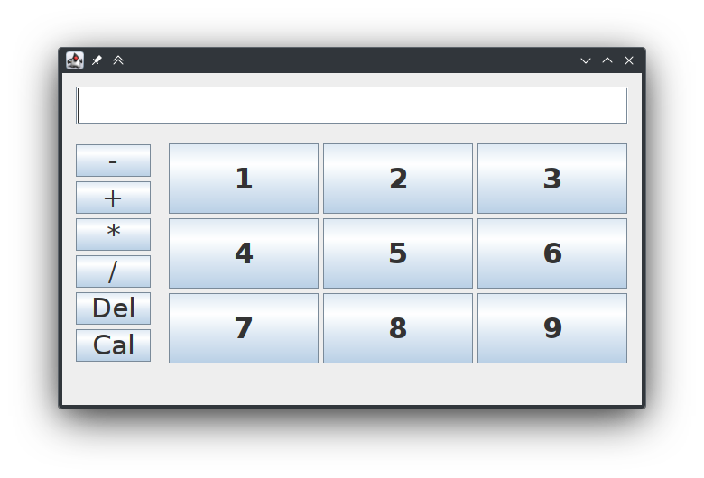

# Calculator

this project was made in `eclipse`
the GUI was made with `swing`




## run calculator:
1. clone my repo:
````
cd ~ && git clone git@github.com:Man2Dev/university-courses.git
````
2. run:
````
java ~/university-courses/Advanced-Programming-course/MyCalculator/src/MainWindow.java
````
